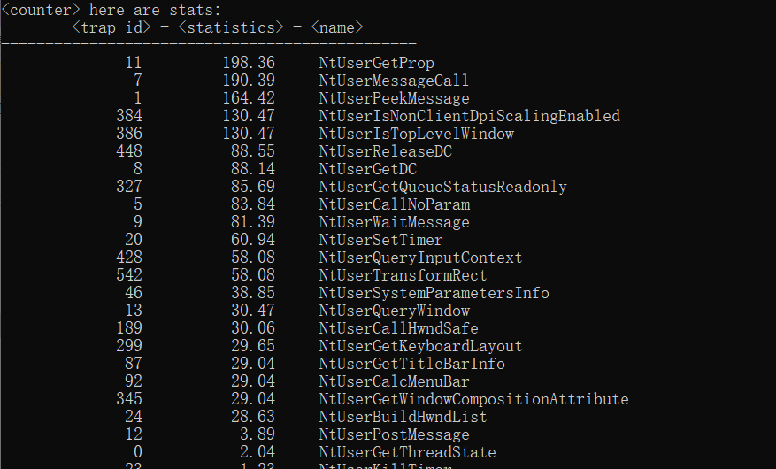
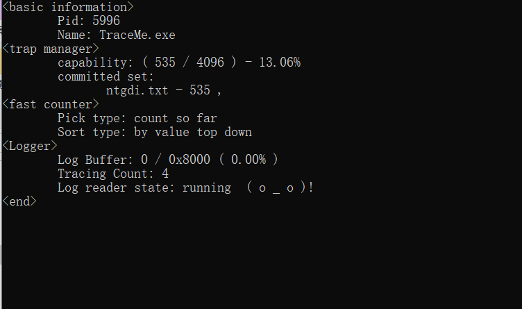
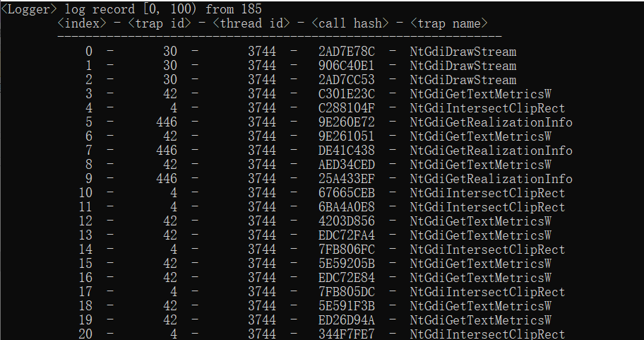
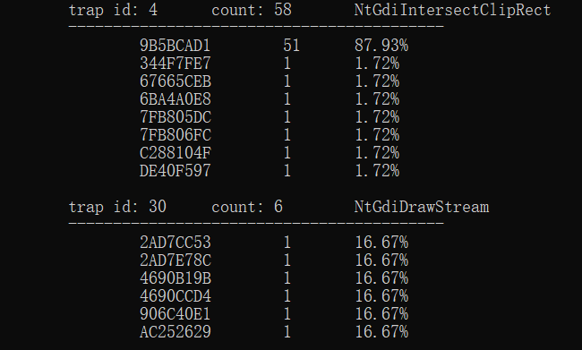
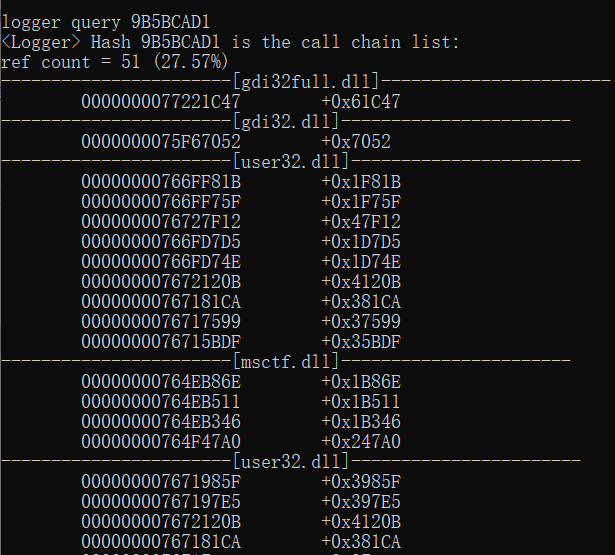

# R3-Syscall-Monitor
Trace Random func call ( not just syscall ) in only usermode, without debugger framework, and * keeps process in a normal speed *.

# How to trace function what I want ?
create a txt file in the "/tasks" directory as a "task set", the basic grammar just like:

  &lt;module1&gt;

  // This is a comment
  
    "MessageBoxA"  "optional description"
    
    #1234       // <- Oridinal in hex
    
    +0x1234     // <- Rva from Image Base
    
  &lt;/module1&gt;
  

  &lt;module2&gt;
    
  ...
  
  &lt;/module2&gt;
  
use "hook" command to apply them.

Counter module and logger module show the call records. 

Counter can show call frequency and count. 

Logger can show caller's return-back chain and thread's id, it can also show the records one-by-one or stack them.

# What should I notice ?
This tool is only for WINDOWS and X86-64, maybe support more in the future.

Logger module may be not very stable if you want to trace a RANDOM address. ( fxsave is not used, maybe used in the future )

If you want to trace a game, the counter module is better.

